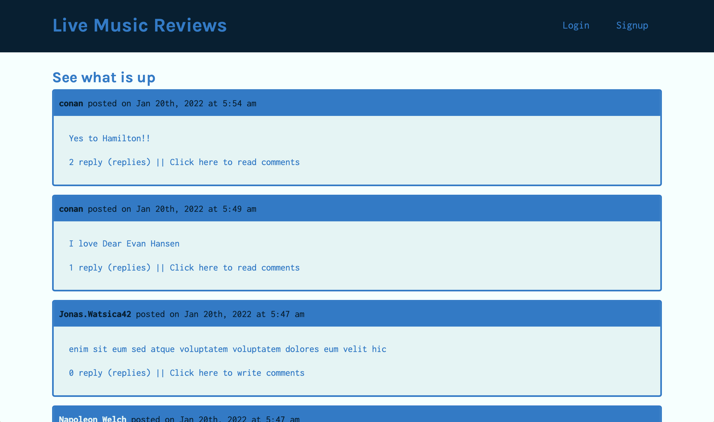

# LiveMusicGeek

## Deployed App

[Application Link](https://livemusicgeek.herokuapp.com)

## Description

This app allows users to post reviews of live shows. Users can comment on review posts, add a reply to a comment, and follow another user.

## How to install

`npm i`

## Technologies used

Node.js, Express.js, JavaScript

CSS styling: referenced and built on previous module projects

MongoDB, Mongoose as ODM

React

graphQL, apollo-server-express, @apollo/client and other packages

jsonwebtoken, jwt-decode

Nodemon

Heroku for deployment

## License

MIT

## Created by:

Name: Jessie

[Link to GitHub](https://github.com/ladystephani)
